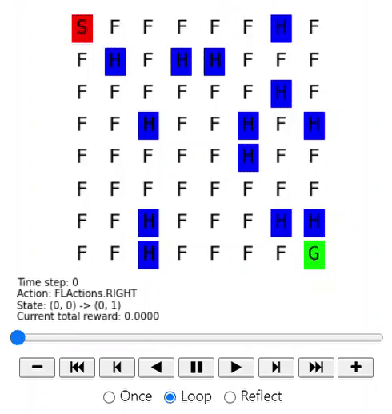
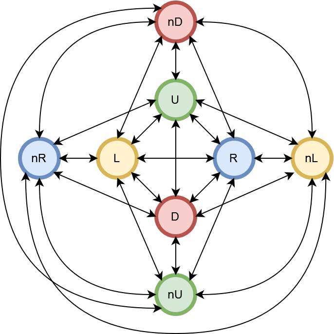
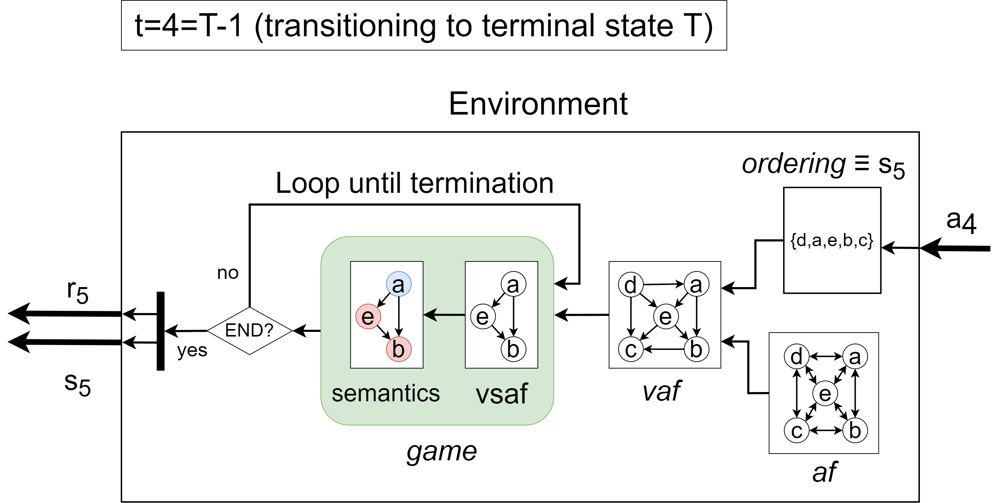

## NEW PROJECT
For the improved version of this project, please check out [ORLA](https://github.com/omcandido/ORLA).
____
# Explainable Online Reinforcement Learning Using Abstract Argumentation
End-to-end reinforcement learning pipeline integrating abstract argumentation. This pipeline trains an agent to solve a reinforcement learning (RL) game and learn a value-based argumentation framework (VAF). The agent is fed an argumentation framework (AF) by the domain expert and it finds the best ordering of its arguments. The outcome is a fully symbolic model that uses a VAF as its inference engine.
## Getting started
A good place to start is the supplied [demo](https://github.com/omcandido/RL-AA/blob/main/src/demo.ipynb). This is a jupyter notebook that will guide you through the basic components of the pipeline and will showcase many of the custom functions. The notebook is not properly rendered on GitHub, but you can download it and you should be able to interact with the saved renderings of the game without running the notebook again. Feel free to run the cells again and experiment with different options.

## Installation
This project uses python 3.9. The external dependencies are listed in [this yml file](https://github.com/omcandido/RL-AA/blob/main/py39.yml). If you use anaconda, you can create a new environment using the yml file by doing something like:
```
conda env create -f py39.yml
```

## Brief explanation
### The game
This pipeline intends to solve a variant of the Frozen Lake game (see Gym environments). In this game, the map is a squared grid world where some cells are frozen (F) and others are holes (H). The agent needs to go from the start (S) in the upper left corner to the goal (G) in the lower right corner. Here is an example of our symbolic agent solving this game: 

<p align="center">
  
</p>

### The AF
The domain expert instantiates some knowledge about the game through an AF. One such AF can be a collection of arguments of the form <b>`X: perform action X IF that cell is safe`</b> and <b>`nX: perform action X if that cell is safe and new`</b>. Here is the representation of such AF.
<p align="center">
  
</p>

### Learning the VAF
The VAF is learned by exploring different orderings of arguments and evaluating the resulting policy on the game. By translating the ordering into state features, it is possible to efficiently decode an ordering that results in an optimal policy. This image shows the inner workings of our ad-hoc environment for an input 5-argument AF (block _af_):
<p align="center">
  
</p>


